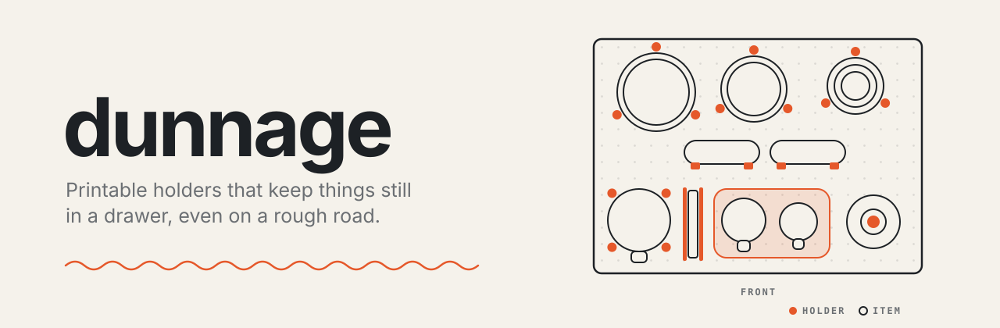

<p align="center">
  
</p>

<p align="center">
  <a href="LICENSE"></a>
  
  
</p>

---

**dunnage** designs 3D-printable holders for the things in a drawer (a kettle, a stack of plates, a pair of mugs) so they stay put while the drawer is in something that moves. You describe what's in the drawer; it works out how each thing is held and exports a 3MF ready to slice.

> *Dunnage* is the freight word for whatever stops cargo shifting in transit: the blocks, braces and chocks around the load, not the load itself.

> [!NOTE]
> dunnage is being built. The first milestone is one real drawer, holding coffee kit, mugs, glasses and crockery, described, laid out and exported to a 3MF that prints on a Bambu P1S in PETG. Until then, the commands and the hosted site below describe what is coming, not what works today.

## Why another drawer organiser

Every drawer-insert generator assumes a kitchen that stays still. Put the same drawer in a van, a truck or a boat and the rules change: a fitted tray full of solid wells is heavy, wastes filament, and still lets a mug walk out of it over a cattle grid.

dunnage is built for **speed bumps, gravel, rough tracks and off-axis tilt**. It is not built for being upside down. It treats two problems separately:

- **Holder to drawer:** the holder must not slide around the drawer floor.
- **Item to holder:** the thing must not hop, slide or rotate out of its holder.

And it follows one rule throughout: **hold, don't fill**. A big item gets a few printed fingers or posts, not a solid block with a hole in it.

## How it works

One plan, five steps. You can go back and forth; changing how something is held can move things, and the plan shows that straight away.

| | Step | What happens |
|:-:|---|---|
| 1 | **Inventory** | List what lives in the drawer and the ways each thing can sit: upright, lying, stacked, on edge. |
| 2 | **Arrange** | Place each thing in the drawer. An agent proposes a layout in task order and writes down why; you drag things about. |
| 3 | **Hold** | Choose how each thing, or a group of things, is held, from a library of methods. |
| 4 | **Make** | Export 3MFs to print, templates to cut ply against, and spec sheets for anything bespoke. |
| 5 | **Lock** | Freeze what you've built. A locked holder never changes, even when dunnage is upgraded, and new layouts design around it. |

## The drawer file

The source of truth is a plain YAML file you can read, diff and commit. The UI edits it by direct manipulation; an agent edits it from a description. Both are first-class.

```yaml
format: drawer/0.2
name: Coffee and tableware
printer: p1s

drawer:
  inside: [700, 500, 150]      # width, depth, height in mm

base:
  kind: bare                   # or gridfinity, or pegboard (IKEA UPPDATERA)

layout:
  - id: kettle
    at: [50, 122.5]
    why: Boiling is step one, so it starts the line. Handle to the front.

  - id: plates
    stack: 4
    at: [140, 367]
    why: Largest stack in the back-left corner.

holders:
  - id: kettle-fingers
    method: posts
    holds: [kettle]
    floor: false
    why: The kettle clears the drawer by 5 mm, so four fingers round the base, no floor.
```

The format is a public contract with its own version, separate from dunnage's. Older files are migrated when they're opened; a file newer than your copy of dunnage is refused rather than guessed at. The full spec and a JSON Schema live in [`docs/format/`](docs/format/).

### Holder methods

| Method | Holds | Good for |
|---|---|---|
| `well` | A shallow pocket shaped to the item | Mugs, small round things, several items in one tray |
| `posts` | A few printed fingers round the base | Kettles, stacks, anything large |
| `slot` | Two walls with the item stood on edge | Scales, chopping boards, filter papers |
| `peg` | A single peg the item drops over | Pour-overs, rolls of tape |
| `gridfinity` | A bin on a Gridfinity baseplate | Drawers that already use the grid |
| `pegboard` | Pegs in an IKEA UPPDATERA board | Rearranging without printing anything |
| `ply` | A printed template to route plywood against | Heavy items, or holders too big for the bed |
| `custom` | A written spec for something bespoke | Everything else |

### Bases

Each drawer has one base: **bare** (holders sit on the drawer floor), **Gridfinity** (a 42 mm grid of whole cells), or **IKEA UPPDATERA** (the slotted pegboard, held by planar form closure: pegs stop a thing sliding every way and turning).

## Using it

**In a browser.** Open the hosted app, point it at a folder of drawer files, and it reads and writes them in place using the File System Access API. Browsers without it fall back to opening and downloading files.

**From the command line.** The same core runs in Node, so agents and CI can use it without a browser:

```sh
npx dunnage check  drawers/coffee.drawer.yml     # validate a file after editing it
npx dunnage export drawers/coffee.drawer.yml     # write 3MFs and spec sheets
```

**With an agent.** Layout is a design problem, not a packing problem (neatness, task order, grouping), so dunnage leaves it to an agent and does the geometry itself: fit, alignment, closing gaps for retention, and export. The agent records its reasons in the file, so every placement explains itself.

**From another project.** Pin a release by tag:

```json
{ "devDependencies": { "dunnage": "github:XDGFX/dunnage#v0.1.0" } }
```

### Your printer

A printer profile is a small file beside your drawers, not a setting inside dunnage. It mostly says what fits on the bed:

```yaml
format: printer/0.2
preset: bambu-p1s
bed: [256, 256, 256]
```

## Development

```sh
bun install
bun run dev      # the UI, served locally
bun run test     # Vitest, on Bun
```

Built with TypeScript, Vite, React and three.js. Holder geometry comes from [manifold-3d](https://github.com/elalish/manifold), which runs as WASM in both the browser and Node.

**Releases are automatic.** A commit that changes behaviour bumps the version in `package.json`, and CI tags `vX.Y.Z` on a release commit that carries the built CLI, so installing a tag with npm or Bun needs no build step. Every push to `main` deploys the hosted app.

## Licence

[MIT](LICENSE).
